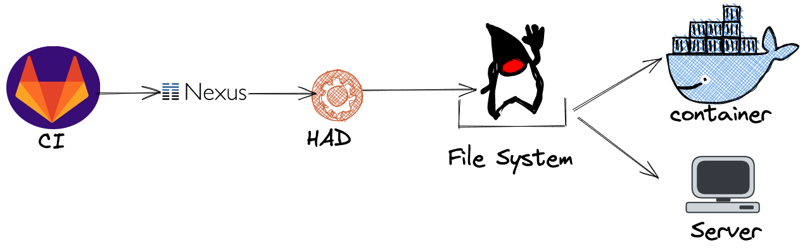

# log4shell : Détecter la dépendance log4j en moins de 50 lignes de code


---


# Qui je suis ?

## Christophe Genin
- Référent technique et fonctionnel à la mutuelle de poitiers assurance.
- Vieux dev fullstack ^^
- twitter : [@skarboune]()
---

# Mutuelle de poitiers assurance
<!-- Comme toutes les banques / assurances, à la mdpa, nous aimons développez en java  -->
<!-- Nous faisons des batchs, des applications et nous avons même des progiciels utilisant java -->
:heart: Java => Application, Progiciel, Batch, etc ...


---

# Puis, le 9/12/2021

## Une faille dans log4j est découverte.

-  Une classe distante peut être exécutée via une faille dans le moteur d'interpolation de Log4j2.


Est-ce que nous avons cette faille dans notre SI ?
 
---

# check des dépendances ?

Via nos outils de builds (maven, gradle) ?

## Sauf que nous avons beaucoup de projet...

 Plus de 100 projets en tout.


Et en plus certains projets sont spéciaux. Par exemple : il rajoute des librairies en dehors du gestionnaire des dépendances. 
<!-- Sachant que nous avons des projets spéciaux. Certains de ces projets par exemple rajoute des librairies en dehors du gestionnaire de dépendances. -->

---

# :bulb: J'ai eu une idée



Pipeline : les artifacts sont copiés sur un file system.
Et si on parsait, nos livrables ?

---
# Aller on crée un cli

D'habitude, on est assez fan de nodejs pour nos clis.

Par contre là, nous avons quelques gigas de livrable à parser...

Et si on utilisait 


<!-- Rust est très performant pour du bas niveau. -->
<!-- Il possède aussi un compilateur très intuitif -->

---

# Premier truc : on fait un hello world

````rust
fn main() {
    println!("hello world")
}
````
---

# Walktree

<!-- Sur notre filesystem, les artifacts sont classés dans plusieurs sous répertoires. Donc, on doit effectuer un parcours des différents dossiers pour ne pas oublier des artifacts.  -->

Une recherche rapide sur un moteur et on trouve : 


--- 

On affiche avec un programme le artifacts java que l'on a trouvés :

````rust
fn main() {
    let walker = WalkDir::new(".");
    for entry in walker
    {
        let entry = entry.unwrap();
        let path = entry.path();

        let path_string = path.display().to_string();
        let result = path_string.to_lowercase().ends_with("war");
        if result {

           println("{}", path_string);     
        }
    }    
}
````

--- 

# Comment on ouvre les fichiers Zip
<!-- Pareil que précédemment une petite recherche  -->


---

En se basant sur l'exemple présent dans le repository du projet :

````rust
....
if result {
    let file = File::open(path).expect("Impossible d'ouvrir le fichier");
    let mut archive = ZipArchive::new(file).expect("Impossible ...");
    for i in 0..archive.len() {
        let mut file = archive.by_index(i).expect("Index non trouvé");
        let name = file.name();
        println!("{}",name)
    }
}
....        
````

Nous affichons l'ensemble de nos fichiers présents dans notre archive.

--- 

````rust
....
 for i in 0..archive.len() {
        let mut file = archive.by_index(i).expect("Index non trouvé");
        let name = file.name();
        if name.contains("log4j") {
            println!("{};{}", path_string, name);
        }
 }       
....        
````

:v: Bingo. Vous avez une première version de votre parseur.

---

## Et maintenant vous allez voir votre ops

- Moi : J'ai fait un programme pour détecter la librairie log4j
- Ops : ok. File moi l'exécutable que je le teste.

Après un certain temps ou un temps certain...


---


- Ops : Ton exe, il fonctionne ? Car il n'affiche rien.
- Moi : C'est bizarre. Lors de mes tests en local, cela a fonctionné.
Tu l'as exécuté dans le répertoire des wars ? 
- Ops : Ben non. De toute façon, je ne peux pas le faire dedans. Tu pourrais me refaire un exe qui parse le répertoire 
`/home/mon-mega-user/2-ef/...` ? 

--- 

Donc, on décide que le ops puisse définir toutes les options 


---

````rust
#[derive(Parser)]
#[clap(version = "1.0", author = "Genin C.")]
struct Opts {
    /// Extension recherchée
    #[clap(short, long, default_value = "war")]
    extension: String,
    /// Répertoire de recherche
    #[clap(short, long, default_value = ".")]
    path: String,
    /// Chaine recherchée
    #[clap(short, long, default_value = "log4j-core")]
    search: String,
}
````

--- 

````rust
....
 let args: Opts = Opts::parse();
    let extension = args.extension.as_str();
    let search = args.search.as_str();
    let walker = WalkDir::new(args.path.as_str());
    for entry in walker
....
````

Et on n'a plus qu'à variabiliser nos entrées.

---


---


## On exécute 

## Et quasi immédiatement, on obtiens


Ben, il n'y a plus qu'à analyser et prendre nos dispositions :smile:

---

# En conclusion

- Cli facilement réalisable en Rust.
- Programmes performants sans utiliser des fonctionnalités avancées.
- Eco Système à la Npm.
- **Toujours rester en veille** : Cela pourra toujours servir un jour :smile:

---

# :clap: Merci à vous.

Des questions ?
